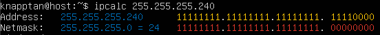
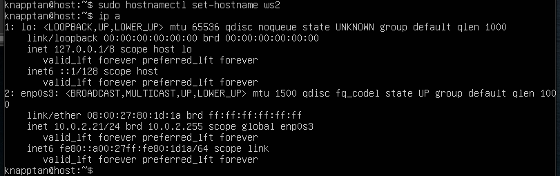
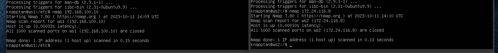
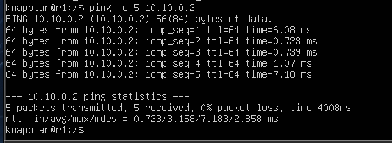
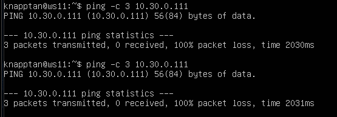
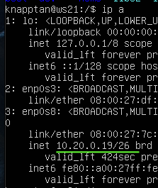

# Сети в Linux
Настройка сетей в Linux на виртуальных машинах.

## Part 1. Инструмент **ipcalc**

- Поднять виртуальную машину (далее -- ws1)

**ipcalc** — это утилита, которая может выполнять простые манипуляции с адресами IPv4.
Если вы просто наберете ` ipcalc ` без каких-либо параметров ввода, это даст хороший вывод «справки» с некоторыми примерами, которые очень полезны для начала работы.

Инструмент ` ipcalc ` можно применять для следующих задач:
- проверить IP-адрес;
- показать рассчитанный широковещательный адрес;
- отображение имени хоста, определенного через DNS;
- отображение сетевого адреса или префикса.

Для установки утилиты ` ipcalc ` следует ввести следующую команду:

> ` sudo apt install ipcalc `

Использование: ` ipcalc [options] ADDRESS [ [/]] [NETMASK] ` .
Опции:
- ` -n ` (**--nocolor**) - подавить вывод цветов;
- ` -b ` (**--nobinary**) - подавить поразрядный вывод;
- ` -c ` (**--class**) - показать маску сети по адресу;
- ` -h ` (**--html**) - показать результаты в HTML;
- ` -v ` (**--version**) - показать версию программы;
- ` -s ` (**--split n1 n2 n3**) - разделить сети по размеру n1, n2, n3;
- ` -r ` (**--range**) - исключить диапазон адресов;
- ` --help ` - помощь.

Особенности ` ipcalc `:
- ` ipcalc ` также выдает двоичные эквиваленты для каждого адреса, что помогает лучше визуализировать адреса;
- пробел в двоичном представлении разделяет сетевую и хостовую часть адреса;
- нельзя указывать в качестве ввода двоичную форму адреса.

- одной из наиболее полезных возможностей ` ipcalc ` является его способность вычислять сегменты сети. Вот пример назначения адреса 10 и 20 двум разным подсетям:

#### IP-классификация

Существуют классификации IP-адресов как «частные» и «публичные». Следующие диапазоны адресов зарезервированы для частных (также известных как LAN) сетей:
- *10.0.0.0* — *10.255.255.255* (*10.0.0.0/8*);
- *172.16.0.0* — *172.31.255.255* (*172.16.0.0/12*);
- *192.168.0.0* — *192.168.255.255* (*192.168.0.0/16*);
- *127.0.0.0* — *127.255.255.255* (зарезервировано для петлевых интерфейсов (не используется для связи между узлами сети), так называемый localhost).

#### Порты

Стандарт определяет для каждого из протоколов **TCP** и **UDP** возможность одновременного выделения до 65536 уникальных портов на хосте, которые обозначаются номерами от 0 до 65535.
Весь ассортимент портов разбит на 3 группы:
- от 0 до 1023 называются привилегированными или зарезервированными (используются для системы и некоторых популярных программ);
- порты с 1024 по 49151 называются зарегистрированными портами;
- порты с 49151 по 65535 называются динамическими портами.

### 1.1. Сети и маски

#### 1.1.1 Определяем адрес сети *192.167.38.54/13* с помощью команды

> ` ipcalc 192.167.38.54/13 `

#### 1.1.2 Перевод маски: 

> ` ipcalc 192.167.38.54/255.255.255.0 `

* префиксная форма записи */24* 
* двоичная форма записи *11111111.11111111.11111111.00000000*
  
  
  
  > ` ipcalc 192.167.38.54/15 `

  * обычная форма записи *255.254.0.0*
  * двоичная *11111111.11111110.00000000.00000000*

> ` ipcalc 192.167.38.54/11111111.11111111.11111111.11110000 `
* обычная форма записи *255.255.255.240*
* префиксная */28*

#### 1.1.3 Минимальный и максимальный хост в сети 12.167.38.4 при масках:

> ` ipcalc 12.167.38.4/8 `

* минимальный хост *12.0.0.1*
* максимальный хост *12.255.255.254* 

> ` ipcalc 12.167.38.4/11111111.11111111.00000000.00000000 `

эквивалентно

> ` ipcalc 12.167.38.4/16 `

* минимальный хост *12.167.0.1*
* максимальный хост *12.167.255.254*

> ` ipcalc 12.167.38.4/255.255.254.0 `

эквивалентно

> ` ipcalc 12.167.38.4/23 `

* минимальный хост *12.167.38.1*
* максимальный хост *12.167.39.254*

> ` ipcalc 12.167.38.4/4 `

* минимальный хост *0.0.0.1*
* максимальный хост *15.255.255.254*

### 1.2. localhost

Определить и записать в отчёт, можно ли обратиться к приложению, работающему на localhost, со следующими IP: 194.34.23.100, 127.0.0.2, 127.1.0.1, 128.0.0.1 .

* приложения к которым можно обратиться через localhost: *127.0.0.2, 127.1.0.1*

> ` ipcalc 127.0.0.2 `

> ` ipcalc 127.1.0.1 `

* приложения к которым нельзя обратиться через localhost: *194.34.23.100, 128.0.0.1*

> ` ipcalc 194.34.23.100 `

> ` ipcalc 128.0.0.1 `

### 1.3. Диапазоны и сегменты сетей

#### 1.3.0 Подсети (Subnets)

#### 1.3.1 Определить и записать в отчёт какие из перечисленных IP можно использовать в качестве публичного, а какие только в качестве частных: 10.0.0.45, 134.43.0.2, 192.168.4.2, 172.20.250.4, 172.0.2.1, 192.172.0.1, 172.68.0.2, 172.16.255.255, 10.10.10.10, 192.169.168.1. 

*Публичный IP адрес* - называется IP адрес, который используется для выхода в Интернет. 
*Частный IP адрес* - адреса, используемые в локальных сетях (не может быть напрямую подключен к Интернету).

* к публичным относятся следующие IP адреса: *134.43.0.2, 172.0.2.1, 192.172.0.1, 172.68.0.2, 192.169.168.1*

* к частным относятся следующие IP адреса: *10.0.0.45, 192.168.4.2, 172.20.250.4, 172.16.255.255, 10.10.10.10*

#### 1.3.2 Определить и записать в отчёт какие из перечисленных IP адресов шлюза возможны у сети 10.10.0.0/18: 10.0.0.1, 10.10.0.2, 10.10.10.10, 10.10.100.1, 10.10.1.255

- маска может быть  10.10.0.0 - 10.10.63.255.

* из перечисленных IP адресов шлюзов у сети 10.10.0.0/18 возможны следующие: 10.10.0.2, 10.10.10.10, 10.10.1.255 .

## Part 2. Статическая маршрутизация между двумя машинами

#### 2.0.1 Поднимаем две виртуальные машины  ws1 и ws2.

В настройках каждой машины во вкладке Сеть задаем Тип подключения: Внутренняя сеть.

Запускаем обе машины и устанавливаем им соответствующие имена хоста:
- для первой машины

> ` sudo hostnamectl set-hostname ws1 `

- для второй машины

> ` sudo hostnamectl set-hostname ws2 `

#### 2.0.2 С помощью команды *ip a* смотрим существующие сетевые интерфейсы

#### 2.0.3 Описать сетевой интерфейс, соответствующий внутренней сети, на обеих машинах и задать следующие адреса и маски: ws1 - 192.168.100.10, маска /16, ws2 - 172.24.116.8, маска /12

С помощью следующей команды ` ip route `  или  ` netstat ` проверяем адреса машин

> ` netstat -nr `

- ` -n ` - отбражение адресов в числовом виде;
- ` -r ` - отображение в виде таблицы.

 - ws1
 
 - ws2
 

Используем следующую команду для открытия файла и установки в нём статического адреса.

> ` sudo vim /etc/netplan/00-installer-config.yaml `

- ` etc/netplan/00-installer-config.yaml ` - файл который нужно отредактировать на каждой машине. Этот файл отвечает за настройку интерфейсов сети.

Этот файл на обеих машинах сначала выглядит одинаково

Дописываем в файлы соответствующие строки.

#### 2.0.4 Выполним команду *netplan apply* для перезапуска сервиса сети

> ` sudo netplan apply `

С помощью следующей команды перепроверяем настройки

> ` ip a `

### 2.1. Добавление статического маршрута вручную

#### 2.1.1 Добавим статический маршрут от одной машины до другой и обратно

> ` sudo ip route add 172.24.116.8 dev enp0s3 `

> ` sudo ip route add 192.168.100.0 dev enp0s3 `

#### 2.1.2 Пропингуем соединение между машинами с помощью следующей команды

> ` ping -c 5 <IP-address> `

- ` -c ` - указывает количество пакетов.

> ` ping -c 5 172.24.116.8 `

> ` ping -c 5 192.168.100.0 `

### 2.2. Добавление статического маршрута с сохранением

Добавляем статический маршрут от одной машины до другой, редактируя файл ` etc/netplan/00-installer-config.yaml `.

> ` sudo vim etc/netplan/00-installer-config.yaml `

Добавляем строки, которые выделины на картинке.

Применяем новые настройки с помощью команды 

> ` sudo netplan apply `

Пропингуем соединение между машинами

> ` ping -c 5 172.24.116.8 `

> ` ping -c 5 192.168.100.0 `

## Part 3. Утилита iperf3

### 3.1. Скорость соединения

Про скорости передачи данных можно прочесть в этой [статье](https://inet-yar.ru/articles/kakoj-skorosti-interneta-dostatochno "Скорость соединения").

Базовой единицей скорости передачи информации является бит в секунду (бит/с).
Разница между байтами в секунду (Б/с) и битами в секунду (бит/c) такая же, как разница между байтами (Б) и битами (бит): 1 Б/с = 8 бит/с.
Точно так же разница между килобайтами в секунду (КБ/с) и Б/с такая же, как разница между килобайтами и байтами: 1 КБ/с = 1024 Б/с. И так далее. 

Перевести и записать в отчёт:

* 8 Mbps (мегабит в секуду) = 1 MB/s (мегабайт в секунду)

* 100 MB/s (мегабайт в секунду) = 800 000 Kbps (килобит в секунду)

* 1 Gbps (гигабит в секунду) = 1 000 Mbps (мегабит в секунду)

### 3.2. Утилита iperf3

#### 3.2.0 Изменения настроек VirtualBox для того чтобы у ws1 и ws2 появился доступ к внешней сети, чтобы установить iperf3

Изначально VirtualBox был настроен так, что на виртуальных машинах в *Настроить - Сеть - Адптер_1 - Тип подключения* выставлена опция *Внутренняя сеть*, а другие *Адаптеры* отключены. Однако такая настройка не позволяет выходить в интернет, соответственно скачивать обновления и устанавливать различные програмные продукты. Чтобы это исправить:

1) Отключаем ` ws1 ` и ` ws2 `.
2) Заходим в настройки каждой: ` ws ` *Сети - Адаптер_1* и устанавливаем *Тип подключения: NAT*.

3) Переходим тут же в *Адаптер_2*, устанавливаем галочку *Включить сетевой адаптер*. После включения адаптера устанавливаем *Тип подключения: Внутренняя сеть*.

4) После настройки машин ` ws1 ` и ` ws2 `, запускаем их.

5) Далее надо настроить. Для этого отредактировать файл ` /etc/netplan/00-installer-config.yaml `.

> ` sudo vim /etc/netplan/00-installer-config.yaml `

6) Принимаем изменеия настроек сети и проверяем настройки интерфейсов

> ` sudo netplan apply `
> ` ip a `

7) Перезагружаем машины 

> ` reboot `

8) После перезагрузки виртуальных машин можно убедиться что всё правильно настроено

 
 
 
Теперь можно устанавливать необходимые програмные пакеты.

#### 3.2 Утилита iperf3: общая информация

**iperf3** — кроссплатформенная консольная клиент-серверная программа — генератор TCP и UDP трафика для тестирования пропускной способности в IP-сетях (поддерживает IPv4 и IPv6). С ее помощью довольно просто измерить максимальную пропускную способность сети между сервером и клиентом и провести нагрузочное тестирование канала связи.
Поскольку утилита имеет как серверную часть так и клиентскую, надо рассматривать обе отдельно. 
Чтобы протестировать пропускную способность сети, вам нужно сначала подключиться к удаленной машине, которую вы будете использовать в качестве сервера. Для запуска сервера (по умолчанию он будет прослушивать порт 5201) используется синтаксис:

> ` iperf3 -s [опции] `

> ` iperf3 -s -f K `

> ` iperf3 -s -D > iperf3log ` 
- ` -f ` - формат в котором выводить информацию (k - кбит, m - мегабит, g - гигабит или K - килобайт, M - мегабайт, G - гигабайт);
- ` -D ` - запустить сервер в качестве демона и записывать сообщения сервера в файл журнала.

Затем на локальном компьютере, который рассматривается как клиент, нужно запустить **iperf3** в клиентском режиме, используя флаг *-c*, и указать хост, на котором работает сервер (используя либо его IP-адрес, либо домен, либо имя хоста).

> ` iperf3 -c [адрес_сервера] [опции] `

> ` iperf3 -c 192.168.10.1 -f K `

Установка утилиты ` iperf3 ` осуществляется с помощью команды

> ` sudo apt install iperf3 `

Для установки и выхода в интернет может потребоваться обновление системы, которое можно сделать с помощью команды.

> ` sudo apt update & upgrade ` 

Запускаем утилиту на ` ws1 ` в режиме сервер с флагом ` -s `. Она будет ожидать пока не запустится этаже утилита на ` ws2 ` в режиме клиента.

> ` iperf3 -s ` 

> ` iperf3 -c ` 

## Part 4. Сетевой экран

[Сетевой или межсетевой экран](https://animatika.ru/info/gloss/firewall.html "Что такое сетевой экран?") – это комплекс программных или аппаратных средств, которые позволяют осуществлять фильтрацию и контроль проходящих через него пакетов в соответствии с заданными заранее параметрами.
Основная задача межсетевого экрана – это защита компьютерных сетей или конкретных узлов от доступа злоумышленников. Межсетевые экраны часто называют фильтрами, что связанно с их основной задачей – фильтровать пакеты, которые не подходят под критерии, определенные в конфигурации.

### 4.1. Утилита iptables

**iptables** — это утилита брандмауэра командной строки, которая использует цепочки политик для разрешения или блокировки трафика. Когда соединение пытается установиться в системе, ` iptables ` ищет правило в своем списке, чтобы сопоставить его. Если утилита не находит нужного правила, она прибегает к действию по умолчанию.

Подсистема ` iptables ` и Netfilter уже достаточно давно встроена в ядро Linux. Все сетевые пакеты, которые проходят через компьютер, отправляются компьютером или предназначены компьютеру, ядро направляет через фильтр ` iptables `. Там эти пакеты поддаются проверкам и затем для каждой проверки, если она пройдена выполняется указанное в ней действие. Например, пакет передается дальше ядру для отправки целевой программе, или отбрасывается.

Переходим в кореневой каталог

> ` cd `

Создаем файл ` /etc/firewall.sh `, имитирующий фаерволл, на ` ws1 ` и ` ws2 ` с помощью команды

> ` sudo touch /etc/firewall.sh `

Добавляем в файл следующие правила согласно задания:

> ` sudo vim /etc/firewall.sh `

1) на ` ws1 ` применить стратегию когда в начале пишется запрещающее правило, а в конце пишется разрешающее правило (это касается пунктов 4 и 5).

2) на ` ws2 ` применить стратегию когда в начале пишется разрешающее правило, а в конце пишется запрещающее правило (это касается пунктов 4 и 5).

3) открыть на машинах доступ для порта 22 (ssh) и порта 80 (http).

4) запретить *echo reply* (машина не должна "пинговаться”, т.е. должна быть блокировка на OUTPUT).

5) разрешить *echo reply* (машина должна "пинговаться").

Запустим файлы на обеих машинах командами

> ` sudo chmod +x /etc/firewall.sh `

> ` sudo bash /etc/firewall.sh `

- на второй машине были проблемы с первой командой, пришлось исправить хостнайм в

``/etc/hosts строка 127.0.0.1 имя_хоста``

Разница между стратегиями, применёнными в первом и втором файлах, заключается в следующем: в утилите ` iptables ` правила выполняются сверху вниз.
На первой машине первым указано запрещающее правило на выход, поэтому она не сможет пропинговать другую машину. У второй машины, наоброт - первым указано разрешающее правило, значит она сможет пропинговать другую машину.

### 4.2. Утилита nmap

**nmap** - это очень популярный сканер сети, для исследования сети и аудита безопасности. Он имеет открытый исходный код, который может использоваться как в Windows, так и в Linux.

Эта программа помогает системным администраторам очень быстро понять какие компьютеры подключены к сети, узнать их имена, а также посмотреть какое программное обеспечение на них установлено, какая операционная система и какие типы фильтров применяются. 

Этот инструмент обычно используется хакерами и энтузиастами кибербезопасности, а также сетевыми и системными администраторами.
Он используется для следующих целей:
- информация о сети в режиме реального времени;
- подробная информация обо всех IP-адресах, активированных в вашей сети;
- количество открытых портов в сети;
- предоставить список живых хостов;
- сканирование портов, ОС и хостов;
- посмотреть типы применямых фильтров.
Например, с помощью скриптов можно автоматически обнаруживать новые уязвимости безопасности в сети.
Чаще всего ` nmap ` используется для сканирования системы по имени хоста или IP-адресу.
Одной из особенностей ` nmap ` является то, что эта утилита может определить, включен ли хост, даже если его нельзя пропинговать.

#### 4.2.1 Поиск машины, которая не "пингуется"

> ` ping IP-address `

В файле ` firewall.sh ` для первой машины первым было указано запрещающее правило, поэтому она не пингуется. Для проверки того чтобы показать, что хост машины запущен воспользуемся утилитой ` nmap `. 
Установим утилиту ` nmap ` с помощью следующей команды. Во время установки появится запрос, нужно будет согласиться.

> ` sudo apt install nmap `

Запускаем утилиту ` nmap ` командой (для проверки ищем в выводе ` nmap ` наличие строки ***Host is up***)

> ` sudo nmap IP-address `

#### 4.2.2 Сохраняем дампы образов виртуальных машин.

Для [сохранения образов машины](https://comphome.ru/virtualbox-virtualnaja-mashina/kak-sohranit-sostojanie-virtualnoj-mashiny-virtualbox.html "Как сохранить состояние VM в VirtualBox") в настройках машины выбираем *Опции - Снимки*.

Выбираем *Сделать* и добавляем снимки. 

Задаём снимку имя и описываем его.
Вид после создания снимков

## Part 5. Статическая маршрутизация сети

Создадим сеть, по следующей схеме

#### 5.0.1 Поднимаем пять виртуальных машин (3 рабочие станции (ws11, ws21, ws22) и 2 роутера (r1, r2)).

Сначала создаём одну виртуальную машину. 
Потом нажимаем правую клавишу мыши на вновь созданной машине, вибираем *Клонировать...* и клонируем ещё 4 машины с соответствующими заданию именами 
(` ws11 `, ` ws21 `, ` ws22 ` и ` r1 `, ` r2 `).

Задаём следующие настройки виртуальным машинам:

**1)** Для машины ` Router r1 ` в *Настроить - Сеть* выставляем:
- *Адаптер_1* оставляем как есть (*Тип подключения: NAT*);

- включаем *Адаптер_2*, выставляем *Тип подключения: Внутренняя сеть* и устанавливаем имя ` int_net_1`;

- включаем *Адаптер_3*, выставляем *Тип подключения: Внутренняя сеть* и устанавливаем имя ` int_net_2`.

В итоге настройки для ` Router r1 ` должны выглядеть так

Запускаем ` r1 ` и меняем имя хоста на соотвтетствующее:

> ` sudo hostnamectl set-hostname r1 `

Перезагружаем машину ` r1 `.

> ` sudo reboot `

**2)** Для машины ` Router r2 `:
- *Адаптер_1* оставляем как есть (*Тип подключения: NAT*);
- Включаем *Адаптер_2*, выставляем *Тип подключения: Внутренняя сеть* и устанавливаем имя ` int_net_2`;
- Включаем *Адаптер_3*, выставляем *Тип подключения: Внутренняя сеть* и устанавливаем имя ` int_net_3`.

В итоге настройки для ` Router r2 ` должны выглядеть так

Запускаем ` r2 ` и меняем имя хоста на соотвтетствующее:

> ` sudo hostnamectl set-hostname r2 `

Перезагружаем машину ` r2 `.

**3)** Для машины ` PC-ws11 ` в *Настроить - Сеть*:
- *Адаптер_1* оставляем как есть (*Тип подключения: NAT*);
- включаем *Адаптер_2*, выставляем *Тип подключения: Внутренняя сеть* и устанавливаем имя ` int_net_1`.

**4)** Для машин ` PC-ws21 ` и ` PC-ws22 `:
- *Адаптер_1* оставляем как есть (*Тип подключения: NAT*);
- включаем *Адаптер_2*, выставляем *Тип подключения: Внутренняя сеть* и устанавливаем имя ` int_net_3`.

Запускаем все ` ws ` и меняем на них имя хоста на соотвтетствующее:

- для машины ` PC-ws11 ` 

> ` sudo hostnamectl set-hostname ws11 `

- для машины ` PC-ws21 `

> ` sudo hostnamectl set-hostname ws21 `

- для машины ` PC-ws22 `

> ` sudo hostnamectl set-hostname ws22 `

Перезагружаем машины ` ws11 `, ` ws21 ` и ` ws22 `.

**4)** Для машины ` PC-ws11 `, ` PC-ws21 ` и ` PC-ws22 ` в *Настроить - Сеть*:
- Адаптер_1 оставляем как есть (*Тип подключения: NAT*);
- Включаем Адаптер_2 и выставляем *Тип подключения: Внутренняя сеть*;

Запускаем ` PC-ws11 ` и меняем имя хоста на соотвтетствующее:

- для машины ` PC-ws11 ` 

> ` sudo hostnamectl set-hostname ws11 `

- для машины ` PC-ws21 `

> ` sudo hostnamectl set-hostname ws21 `

- для машины ` PC-ws22 `

> ` sudo hostnamectl set-hostname ws22 `

Перезагружаем машины ` ws11 `, ` ws21 ` и ` ws22 `.

Проверяем какие интерфейсы есть на машине  ` r1 `. И подобным образом можно проверить все остальные машины. На машинах ` ws ` их будет на 1 меньше.

> ` ip a `

С помощью  утилиты ` netplan ` в файле ` etc/netplan/00-installer-config.yaml ` прописываем настройки для машин, согласно схемы сети. Используем следующую команду на всех машинах для редактирования адресов.

> ` sudo vim /etc/netplan/00-installer-config.yaml `

Настройки роутеров

Настройки машин 

Проверим, что адрес машин задан верно. 

> ` ip -4 a `

Роутер 1 

Роутер 2

Машина 11

Машина 21

Машина 22

Пропингуем ` ws22 ` с ` ws21 ` с помощью команды 

> ` ping -c 5 10.20.0.10 `
 

Аналогично пингуем ` r1 ` с ` ws11 ` 

> ` ping -c 5 10.10.0.2 `

### 5.2. Включение переадресации IP-адресов.

Для включения переадресации IP, выполняем команду на роутерах 

> ` sudo sysctl -w net.ipv4.ip_forward=1 `

Но при таком подходе переадресация не будет работать после перезагрузки системы.

Откроем файл ` /etc/sysctl.conf ` 

> ` sudo vim /etc/sysctl.conf `

Раскомментируем строку ` net.ipv4.ip_forward = 1 ` и сохраним изменения. Теперь IP-переадресация включена на постоянной основе.

### 5.3. Установка маршрута по-умолчанию

Настраиваем маршрут по-умолчанию (шлюз) для рабочих станций. Для этого добавляем ` gateway4: ip роутера ` в файле конфигураций ` etc/netplan/00-installer-config.yaml `

> ` sudo vim /etc/netplan/00-installer-config.yaml `

После изменения настроек применяем команду для вступления в силу изменений

> ` sudo netplan apply `

Вызовем ` ip r `, чтобы показать, что  маршрут добавился в таблицу маршрутизации

Пропингуем с ` ws11 ` роутер ` r2 `, пинг не пройдёт, т.к. роутер "не знает" куда вернуть ответ, при этом передача пакетов с машины осуществляется. 

Чтобы посмотреть какие девайсы можно пропинговать

> ` tcpdump -D ` 

Запускаем на ` r2 ` утилиту ` tcpdump `, она позволяет прослушать порты и вывести на экран информацию с каких IP адресов приходят пакеты. В данном случае слушаем интерфейс ` enp0s8 `

> ` tcpdump -tn -i enp0s8 `

Сначала на экране r2 будет пусто, идёт ожидание входящих пакетов

Запускаем ` ping ` на ` ws11 ` 

> ` ping -c 5 10.100.0.12`

На экране ` r2 ` появится 

### 5.4. Добавление статических маршрутов

#### 5.4.1 Добавить в роутеры r1 и r2 статические маршруты в файле конфигураций.

Отредактируем файлы конфигураций сети путем изменения содержания файла ` etc/netplan/00-installer-config.yaml ` для каждого роутера.

> ` sudo vim /etc/netplan/00-installer-config.yaml `

Для вступления изменений в силу воспользуемся командой

> ` sudo netplan apply `
С помощью ` ip r ` проверяем настройки на роутерах

- 10.20.0.0/26 через 10.100.0.12 устройство enp0s9
- 10.10.0.0/18 через 10.100.0.11 устройство enp0s8

Запустить команды на ` ws11 `

> ` ip r list 10.10.0.0/18 `

> ` ip r list 0.0.0.0/0 `

Для адреса *10.10.0.0/18* был выбран маршрут, отличный от *0.0.0.0/0* (он попадает под маршрут по-умолчанию), т.к. машина ` ws11 ` соединена с сетью *10.10.0.0/18* по своему IP-адресу *10.10.0.2*, для других адресов используется маршрут по умолчанию, который указан в файле *10.10.0.1*.

### 5.5. Построение списка маршрутизаторов

Для установки утилиты на ` ws11 ` используем команду 

> ` sudo apt install traceroute `

Из-за ограничений по количеству мак адресов пришлост отключать временно адаптер на машине для загрузки пакетов

Запустим на ` r1 ` команду дампа 

> ` tcpdump -tnv -i enp0s8 `

- -n - не конвертировать адреса в имена;
- -t - не выводить время при выводе каждой строкчи дампа;
- -v - при синтаксическом анализе и выводить более подробную информацию. Например, печатаются время создания, общая длина и параметры IP-пакета. Также включает дополнительные проверки целостности пакетов, такие как проверка контрольной суммы заголовка IP и ICMP.

При помощи утилиты ` traceroute ` построим список маршрутизаторов на пути от ` ws11 ` до ` ws21 `. 

>Каждый пакет проходит на своем пути определенное количество узлов, пока достигнет своей цели. Причем, каждый пакет имеет свое время жизни. Это количество узлов, которые может пройти пакет перед тем, как он будет уничтожен. Этот параметр записывается в заголовке TTL, каждый маршрутизатор, через который будет проходить пакет уменьшает его на единицу. При TTL=0 пакет уничтожается, а отправителю отсылается сообщение Time Exceeded.

>Команда traceroute linux использует UDP пакеты. Она отправляет пакет с TTL=1 и смотрит адрес ответившего узла, дальше TTL=2, TTL=3 и так пока не достигнет цели. Каждый раз отправляется по три пакета и для каждого из них измеряется время прохождения. Пакет отправляется на случайный порт, который, скорее всего, не занят. Когда утилита traceroute получает сообщение от целевого узла о том, что порт недоступен трассировка считается завершенной.

### 5.6. Использование протокола ICMP при маршрутизации

Запустим на ` r1 ` перехват сетевого трафика, проходящего через ` enp0s8 ` с помощью команды

> ` sudo tcpdump -n -i enp0s8 icmp `

Пропингуем с ` ws11 ` несуществующий IP (например, 10.30.0.111) с помощью команды 

> ` ping -c 1 10.30.0.111 `

Сохраняем дампы образов виртуальных машин

## Part 6. Динамическая настройка IP с помощью DHCP

### 6.1 Настройка службы DHCP на r2

Если утилита ` isc-dhcp-server ` ещё не установлена, то файла ` /etc/dhcp/dhcpd.conf ` ещё не существует в нужном виде. Соотвтетственно для работы с протоколом **DHCP** сначала надо установить эту утилиту

> ` sudo apt-get install isc-dhcp-server `

Теперь для **r2** можем настроить в файле ` /etc/dhcp/dhcpd.conf ` конфигурацию службы  ` DHCP `

1) указываем адрес маршрутизатора по-умолчанию, DNS-сервер и адрес внутренней сети.

Открываем файл ` /etc/dhcp/dhcpd.conf ` для редактирования

> ` sudo vim /etc/dhcp/dhcpd.conf `

Так выглядит только что открытый файл ` dhcpd.conf `

Вносим изменения

2) в файле ` /etc/resolv.conf `(содержит адреса серверов имен, к которым имеет доступ данная система) прописываем ` nameserver 8.8.8.8 `

> ` sudo vim /etc/resolv.conf `

Перезагрузим службу **DHCP**

> ` systemctl restart isc-dhcp-server `

Можно проверить статус службы

> ` sudo systemctl status isc-dhcp-server `

В моем случае была ошибка в заплнении файла, для рещения проблемы пришлось зайти sudo su и проверить $ journalctl _PID=номер операции из статуса
журнал показал в чем ошибка и удалось исправить 

Изменим настройки машин **ws21** и **ws22** в файле конфигурации, чтобы сделать протокол **DHCP** активным. На каждой машине введём

> ` sudo vim /etc/netplan/00-installer-config.yaml `

> ` sudo netplan apply `

Перезагружаем виртуальне машины **ws21** и **ws22**

> ` sudo systemctl reboot `

Проверяем присвоенный устройствам адрес

Проверим соединение машины **ws22** с **ws21** 

### 6.2 Указать MAC-адреса 

Чтобы указать MAC-адрес у **ws11**, в файл ` etc/netplan/00-installer-config.yaml ` надо добавить строки: ` macaddress: 10:10:10:10:10:BA `, ` dhcp4: true `

> ` sudo vim /etc/netplan/00-installer-config.yaml `

> ` sudo netplan apply `

[Выключаем](https://losst.ru/vyklyuchenie-linux-iz-komandnoj-stroki "Выключение LINUX из командной строки") машину **ws11**

> ` sudo shutdown -h now`

Заходим в менеджер виртуальных машин VirtualBox и там настраиваем **ws11** MAC-адрес

Для **r1** настроим аналогично **r2**, но выдачу адресов сделаем с жесткой привязкой к MAC-адресу (**ws11**).

> ` sudo apt-get install isc-dhcp-server `

> ` sudo vim /etc/dhcp/dhcpd.conf `

> ` sudo vim /etc/resolv.conf `

> ` systemctl restart isc-dhcp-server `

> ` sudo systemctl status isc-dhcp-server `

Проводим аналогичные тесты - смотрим какой адрес назначен машине **ws11**

> ` ip a `

Пропингуем соединение

> ` ping -c 5 10.10.0.4 `

### 6.3 Обновление ip адреса с помощью команды *sudo dhclient*.

Проверяем IP до обновления

Запросим с **ws21** обновление ip адреса с помощью команды

> ` sudo dhclient -v `

- ` -v ` - будет выведена дополнительная информация.

> ` ip a `

Выполним команду для удаления старого IP адреса

> ` sudo dhclient -r `

- ` -r ` - явно освобождает текущую аренду ip адреса.

Чтобы обновить или освободить IP-адрес для конкретного интерфейса, например, eth0, необходимо ввести:

> ` sudo dhclient -r eth0 `

> ` sudo dhclient eth0 `

Проверим IP адреса

> ` ip a `

> В части 6 были использованы следующие опции **DHCP** протокола:
  >* option routers *ip-address [, ip-address...];* - адреса шлюзов для клиентской сети. Маршрутизаторы должны быть перечислены в порядке предпочтительности.
  >* option domain-name-servers *ip-address [, ip-address...];* - Список DNS серверов  доступных клиенту. Сервера должны быть перечислены в порядке предпочтительности.

Сохраняем дампы образов виртуальных машин.

## Part 7. NAT

Для работы с сервером ` apache2 `, установим его на машины ` r1 `, ` r2 ` и ` ws22 `. Возможно ` apache2 ` не будет устанавливаться, тогда возможно поможет обновление системы (см. ниже).

> ` sudo apt install apache2 `

Обновление системы

> ` sudo apt update `

> ` sudo apt upgrade -y `
- ` -y ` - при запросе сразу согласиться с установкой.

### 7.1 Делаем сервер Apache2 общедоступным.

В файле ` /etc/apache2/ports.conf ` на ` ws22 ` и ` r2 ` меняем строку ` Listen 80 ` на ` Listen 0.0.0.0:80 `.

> ` sudo vim /etc/apache2/ports.conf `

Запустить веб-сервер **Apache** командой на ` ws22 ` и ` r1 `

> ` service apache2 start ` 

### 7.2 Создаем фаервол на r2 [(как в части 4)](#41-утилита-iptables). Следующие правила:

1) Удаление правил в таблице filter - ` iptables -F `
2) Удаление правил в таблице "NAT" - ` iptables -F -t nat `
3) Отбрасывать все маршрутизируемые пакеты - ` iptables --policy FORWARD DROP `

Запустим файл на машине командами

> ` sudo chmod +x /etc/firewall.sh `

> ` sudo bash /etc/firewall.sh `

 При запуске файла ` firewall.sh ` с этими правилами, ` ws22 ` не должна "пинговаться" с ` r1 `.

4) Разрешить маршрутизацию всех пакетов протокола ICMP, для этого прописываем правило для протокола *icmp* и цепочки *FORWARD*

Теперь при запуске файла ` firewall.sh ` с этими правилами, ` ws22 ` должна "пинговаться" с ` r1 `

Добавляем в файл ещё два правила:

5) Включаем **SNAT**, а именно маскирование всех локальных ip из локальной сети, находящейся за ` r2 ` (по обозначениям из Части 5 - сеть 10.20.0.0)

6) Включаем **DNAT** на 8080 порт машины ` r2 ` и добавим к веб-серверу Apache, запущенному на ` ws22 `, доступ извне сети

> Значения использованных опций:
> - ` t ` - указывает на используемую таблицу;
> - ` p ` - указывает протокол, такие как tcp, udp, udplite и другие, поддерживаемые системой, ознакомиться со списком можно в файле ` /etc/protocols `;
> - ` m ` - подключает указанный модуль;
> - ` s ` - указывает адрес источника пакета, в качестве значения можно указать как один IP-адрес, так и диапазон;
> - ` i ` - задает входящий сетевой интерфейс;
> - ` o ` - указывает исходящий сетевой интерфейс;
> - ` --dport ` - порт получателя пакета;
> - ` DNAT ` — подменяет адрес получателя в заголовке IP-пакета, основное применение — предоставление доступа к сервисам снаружи, находящимся внутри сети;
> - ` SNAT ` — служит для преобразования сетевых адресов, применимо, когда за сервером находятся машины, которым необходимо предоставить доступ в Интернет, при этом от провайдера имеется статический IP-адрес.

#### SNAT и DNAT 

**NAT** — это аббревиатура для преобразования сетевых адресов.

ПАРАМЕТР| **SNАТ**| **DNAT** 
---------|----------|----------- 
Аббревиатура |источник **NAT**|назначение **NAT**
Терминология|**SNAT** изменяет частный IP-адрес исходного хоста на общедоступный IP-адрес. Он также может изменить исходный порт в заголовках TCP/UDP. **SNAT** обычно используется внутренними пользователями для доступа в Интернет. |Назначение **NAT** изменяет адрес назначения в IP-заголовке пакета. Он также может изменить порт назначения в заголовках TCP/UDP. **DNAT** используется, когда нам нужно перенаправить входящие пакеты с общедоступным адресом/портом на частный IP-адрес/порт внутри внутренней сети. 
Пример использования |Клиент внутри локальной сети и за брандмауэром хотел просматривать Интернет|Веб-сайт, размещенный в центре обработки данных за брандмауэром, и должен быть доступен для пользователей через Интернет
Изменение адреса|**SNAT** изменяет адрес источника пакетов, проходящих через устройство **NAT**|**DNAT** изменяет адрес назначения пакетов, проходящих через маршрутизатор.
Порядок работы|**SNAT** выполняется после принятия решения о маршрутизации.|**DNAT** выполняется до принятия решения о маршрутизации. 
Коммуникационный поток|Когда внутренняя защищённая сеть инициирует связь с внешним миром, происходит **SNAT**|Когда внешняя незащищенная сеть инициирует связь с внутренней защищенной сетью, происходит **DNAT**. 
Один/несколько хостов|**SNAT** позволяет использовать несколько хостов во «внутренней» сети для доступа к любому хосту во «внешней» сети|**DNAT** позволяет любому хосту во «внешней» сети получить доступ к одному хосту во «внутренней» сети

Запускаем файл также, как в Части 4 (перед тестированием отключим сетевой интерфейс **NAT** (его наличие можно проверить командой ` ip a `) в VirtualBox, если он включен)

Проверяем соединение по TCP для SNAT, для этого с ` ws22 ` подключаемся к серверу Apache на ` r1 ` командой ` telnet [адрес] [порт] `

> ` telnet 10.100.0.11 80 `

Проверяем соединение по TCP для DNAT, для этого с ` r1 ` подключаемся к серверу Apache на ` ws22 ` (обращаться по адресу ` r2 ` и порту 8080)

> ` telnet 10.100.0.12 8080 `

Сохраняем дампы образов виртуальных машин

## Part 8. Дополнительно. Знакомство с **SSH Tunnels**

*В данном задании используются виртуальные машины из Части 5*

##### Запускаем на r2 фаервол с правилами из Части 7

##### Запускаем веб-сервер **Apache** на ws22 только на localhost (то есть в файле */etc/apache2/ports.conf* изменить строку `Listen 80` на `Listen localhost:80`)

> ` service apache2 start `

##### Воспользуемся *Local TCP forwarding* с ws21 до ws22, чтобы получить доступ к веб-серверу на ws22 с ws21

Переадресация локального порта позволяет перенаправить порт на локальном компьютере (клиент ssh) на порт на удаленном компьютере (сервер ssh), который затем перенаправляется на порт на компьютере назначения.
В этом типе переадресации клиент SSH прослушивает заданный порт и туннелирует любое подключение к этому порту к указанному порту на удаленном сервере SSH, который затем подключается к порту на целевом компьютере. Конечным компьютером может быть удаленный SSH-сервер или любой другой компьютер.

Пробрасывать порт от сервера будем по следующему алгоритму:
1) На машине ` ws22 `: создадим соединение с машины ` ws22 `, на которой установлен сервер ` ssh `, с машиной ` ws 21 `.
Использем команду ` ssh -L [local_port]:localhost:[local_port] [remote_ip] `
> ` ssh -L 8080:127.0.0.1:80 10.20.0.20 `

Проверяем с помощью команды `telnet 127.0.0.1 8080`  

2) На машине ` ws22 `: с помощью команды ` ssh -L ` прокинем "прямое" соединение с машины ` ws21 ` на машину ` ws22 `.
Использем команду ` ssh -R [local_port]:localhost:[local_port] [remote_ip] `
> ` ssh -R 10.10.0.2:8080:127.0.0.1:80 10.10.0.2 `

Проверяем с помощью команды `telnet 127.0.0.1 8080`
